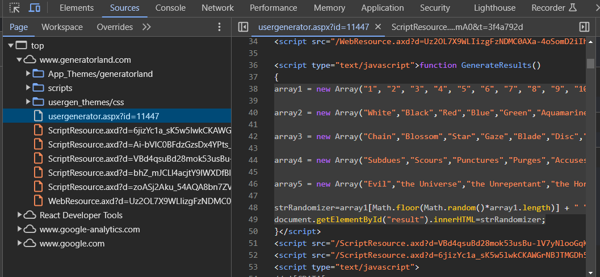

# K6BD Angel Name Generator

An adaptation and clone of the "Generatorland" version of this generator. 

Since that website is closing at the end of 2024, here's a replacement for this specific generator at least.

## Credits

- Original "Generatorland"-hosted generator by user "antimony"
- Kill Six Billion Demons series by Tom Parkinson-Morgan

## Is this really the original generator?

Yes! In fact, until Generatorland shuts down, you can go and copy the generator out yourself through the same way that I did.

1. Visit your desired generator (in this case:   ).
2. Open your browser's developer tools. 
	- The rest of these steps assume you're using Google Chrome, and refer to things visible in their dev tools.
3. Navigate to the "Sources" tab.
4. Find the "usergenerator.aspx" source and click on it.
5. Inspect the code until you find a `` that looks like it has data relevant to your generator.

For example, the K6BD Angel Name Generator looks like this:

It's easy to copy that across to a standalone JavaScript file and rework its execution & output.